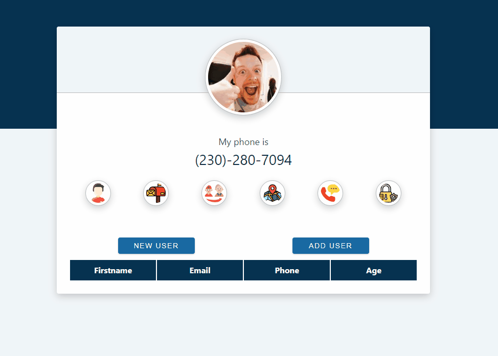

# Random User
This project is a React application that displays and adds random users. Users can be managed with customized notifications using the SweetAlert library.
## Screenshots
 

[Random User Live Page](https://random-user-esma.netlify.app/)

## Tech/framework used
<b>Built with</b>  
 
 

## How to use?
Hover over the icons to view relevant information.  
Add new users with the ability to check for existing users.
## Description
In the project directory, you can run:
### `npm start`
Runs the app in the development mode.\
Open [http://localhost:3000](http://localhost:3000) to view it in your browser.

##API Reference
https://randomuser.me/api/

 
